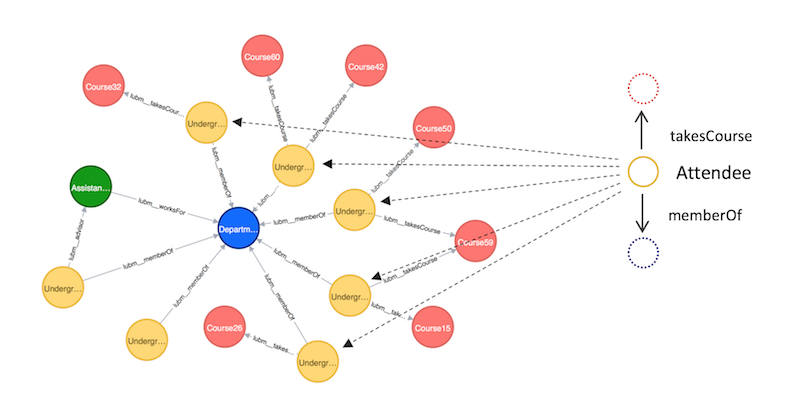

A Java based RDF database management system was developed using the Minibase codebase.
<ul>
  <li>Implemented various queries and sorting mechanisms to navigate a RDF database system.</li>
  <li>In a group of 5 members, I developed the Sorting and Query mechanisms to efficiently fetch data from large databases using operations like Hash Oriented Joins.</li>
  <li>The database was integerated with various functionalities like multilevel joins and queries</li>
  <li> Three different Joins were implemented namely Hash Oriented Joins, Tuple Oriented Join and Sort Merge Join</li>
</ul>
 
Source: <a href="https://github.com/vivekkeshava/RDFDatabase">RDFDatabase</a>
